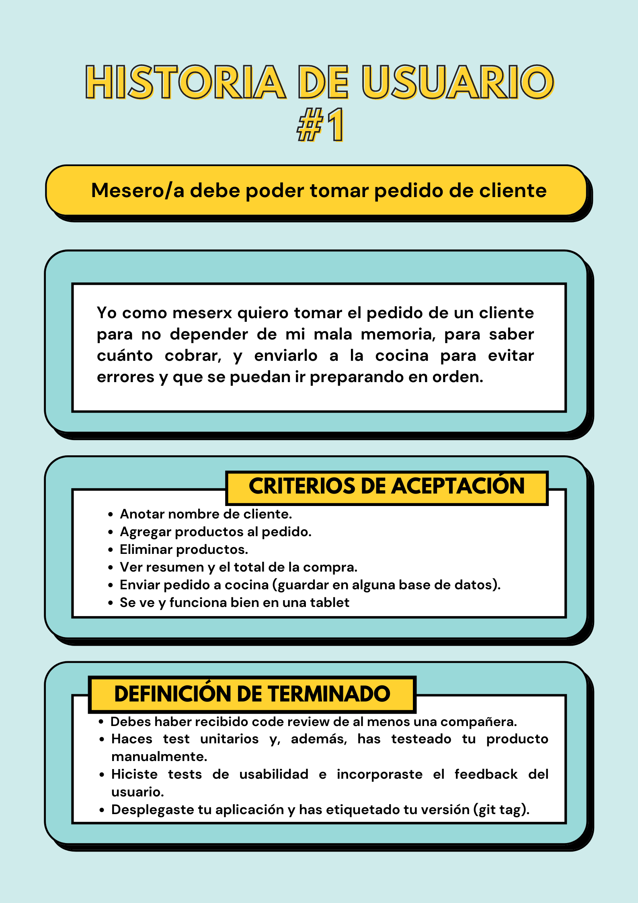
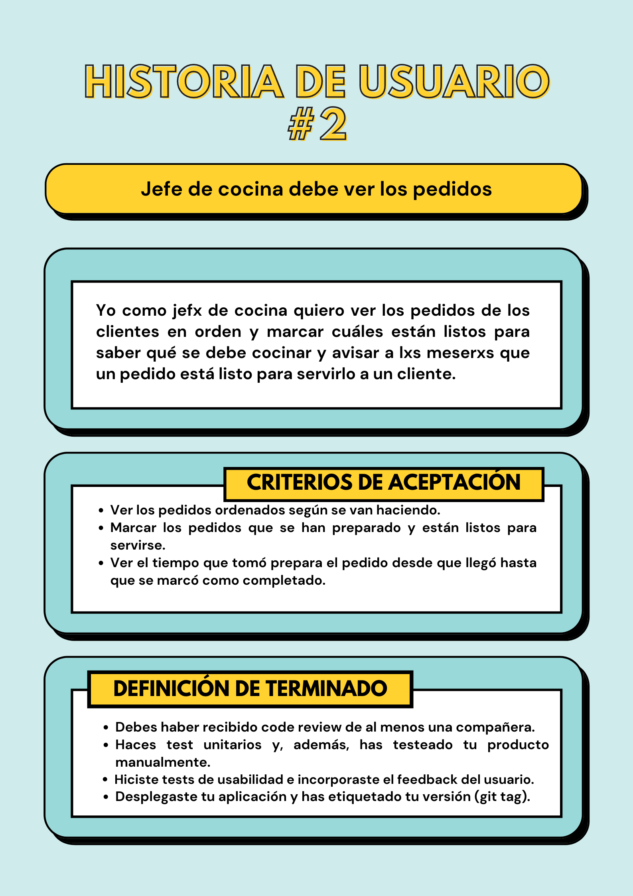
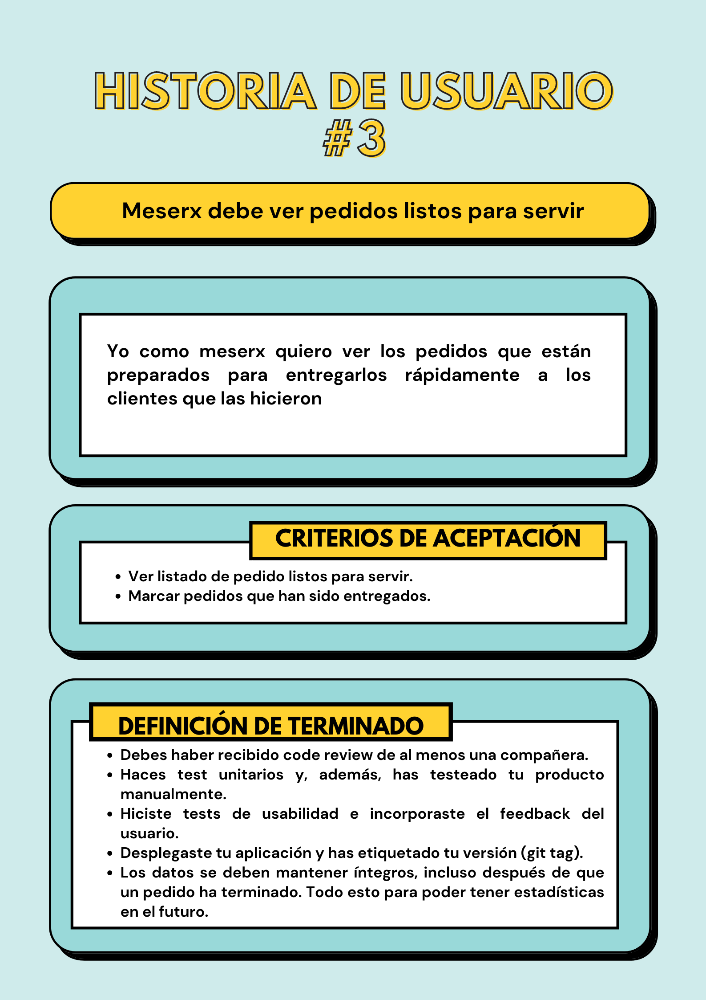

# Burger Queen

## Índice

- [1. Introducción]()
- [2. Resumen del proyecto]()
- [3. Consideraciones técnicas ]()
- [4. Definición del producto]()
- [5. Despliegue]()
- [6. Autoras]()

---

## 1. Introducción

## 2. Resumen del proyecto

Makis Queen es un aplicativo web para un restaurante

## 3. Consideraciones técnicas
### 3.1. Tecnologías empleadas

- <a href="https://angular.io/">Angular</a>
- <a href="https://www.typescriptlang.org/">TypeScript</a>
- <a href="https://firebase.google.com/docs?authuser=0&hl=es">Firebase</a>
- <a href="https://getbootstrap.com/docs/5.1/getting-started/introduction/">Bootstrap</a>: 
- <a href="https://sass-lang.com/documentation">SASS</a>
- <a href="https://www.netlify.com/">Netlify</a>

## 4. Definición del producto

---

---

---

---

## 5. Ejecución del proyecto
### 5.1. Diseño 
Integramos ATOMIC DESIGN como metodología de diseño del producto, esto nos permite verificar que cada elemento de la interfaz debe funcionar tanto de manera individual como en conjunto. Para llevar a cabo el desarrollo de los prototipos bajo esta metodología elegimos la herramienta FIGMA. 

### 5.2. Prototipos
#### 5.2.1. Prototipo baja fidelidad

#### 5.2.2. Prototipo alta fidelidad

## 6. Despliegue
Para el despliegue de nuestra aplicación utilizamos NETLIFY el cual te permite crear, alojar y mantener tu sitio web con implementación continua.

[AppDesplegada]()

## 7. Autoras

### Luz Torres Villavicencio
  * <code></code>

  * <code></code>

### Pilar Rivera Romero
  * <code></code>

  * <code></code>
